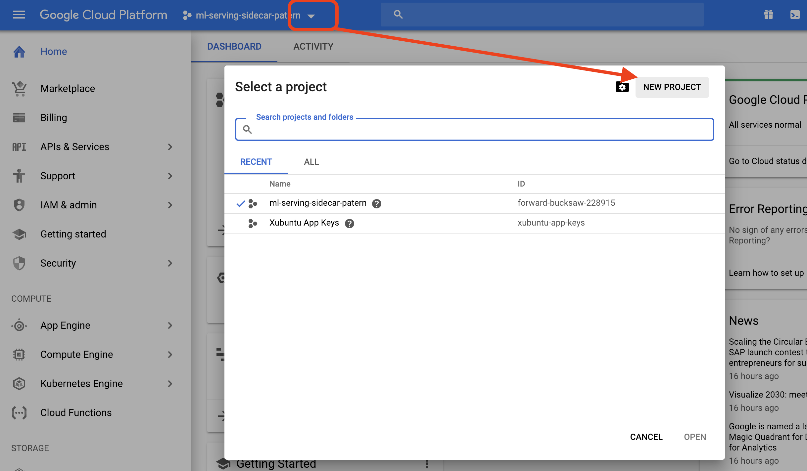
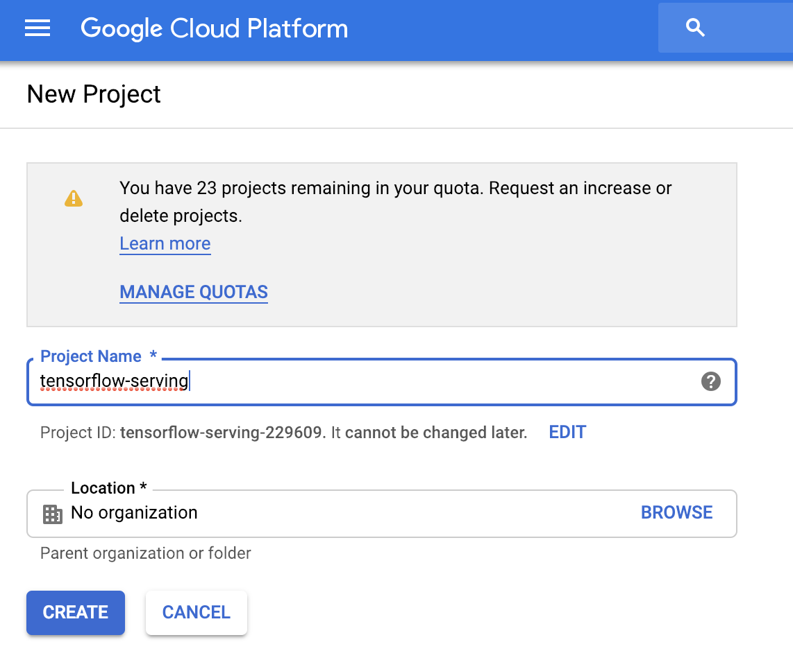
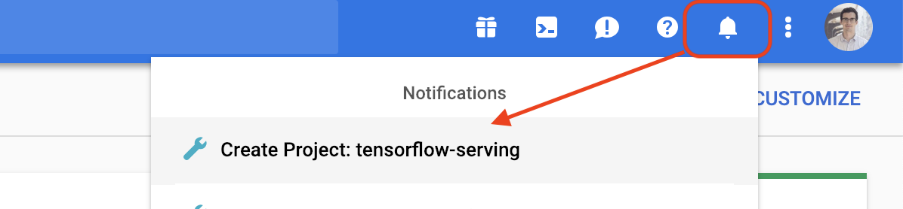
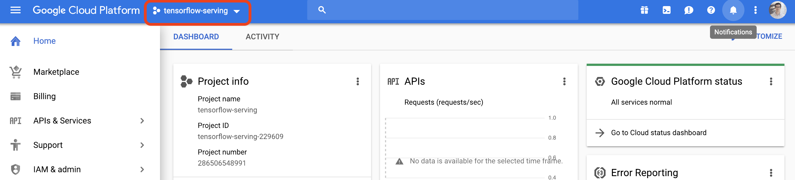
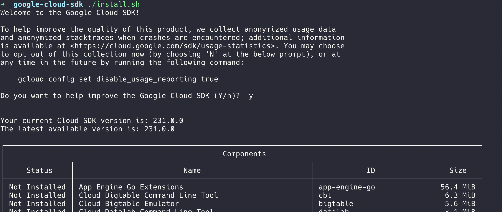
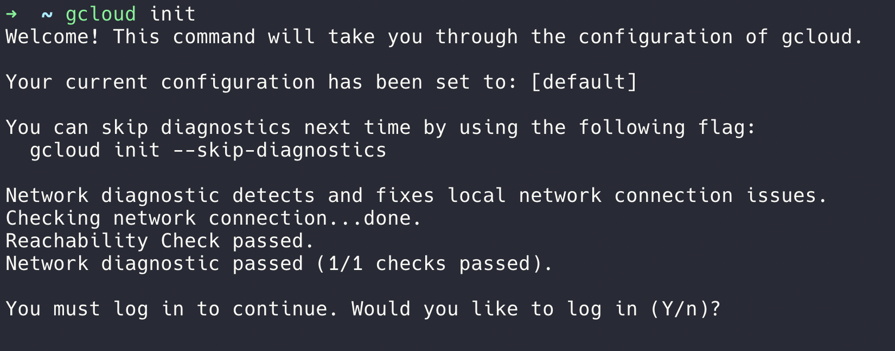
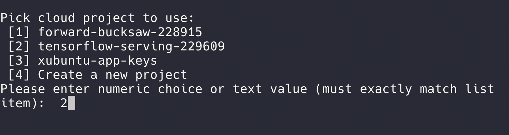

# Cloud environment setup
Here we detail how to install `gcloud` utils on your machine to interact with a project on Google Cloud Platform.

## 1 Create a Google Cloud Platform project
Creating a GCP project is pretty straightforward. Here, a project simply means a context in which computing resources are managed.
If you are completely new to GCP here are a few screenshots to guide you through:

1. Create a GCP project named tensorflow-serving: 


2. Type the name of your project 


3. Wait a few seconds for the project to be created and click on it in the notifications center:


Ok you are now working on the `tensorflow-serving` GCP project!



## 2 Install the `gcloud` command line interface

`gcloud` CLI enable you to interact with the resources of your GCP account. Here is the installation process, 

### On MacOS
1. Download the `gcloud` archive file  https://dl.google.com/dl/cloudsdk/channels/rapid/downloads/google-cloud-sdk-231.0.0-darwin-x86_64.tar.gz

2. Extract the archive to any location on your file system; preferably, your home directory.
This can be achieved by opening the downloaded `.tar.gz` archive file in the preferred location.`


### On Linux

1. Curl the ``gcloud`` archive 
```bash
curl -O https://dl.google.com/dl/cloudsdk/channels/rapid/downloads/google-cloud-sdk-231.0.0-linux-x86_64.tar.gz
```

2. Extract the archive to any location on your file system; preferably, your Home folder. On Linux, you can extract the archive file by running this command:
````bash
tar zxvf [ARCHIVE_FILE] google-cloud-sdk
````

### Common steps:

3. Go to the `google-cloud-sdk` folder and run `./install.sh` you are prompted a few questions, answer and proceed. Restart your terminal for the changes to take effect


4. We now have to initialize `gcloud` to describe which project to work on by default. 
We just created a `tensorflow-serving` project in the previous section, let's use it! Run `gcloud init`: a prompt appears:
you login to your GCP account and select the working project to be `tensorflow-serving`.





5. You may also need `kubectl` to manage your kubernetes cluster on GCP, install it with `gcloud components install kubectl`.

Great you now have your default `gcloud` configuration!

----
### Resources:

- As the documentation evolves quickly you may want yo refer to the official documentation to complete on how to install `gcloud` 
    - for MacOs: https://cloud.google.com/sdk/docs/quickstart-macos
    - for Linux: https://cloud.google.com/sdk/docs/quickstart-linux

- list of available GCP ``zones`` https://cloud.google.com/compute/docs/regions-zones/