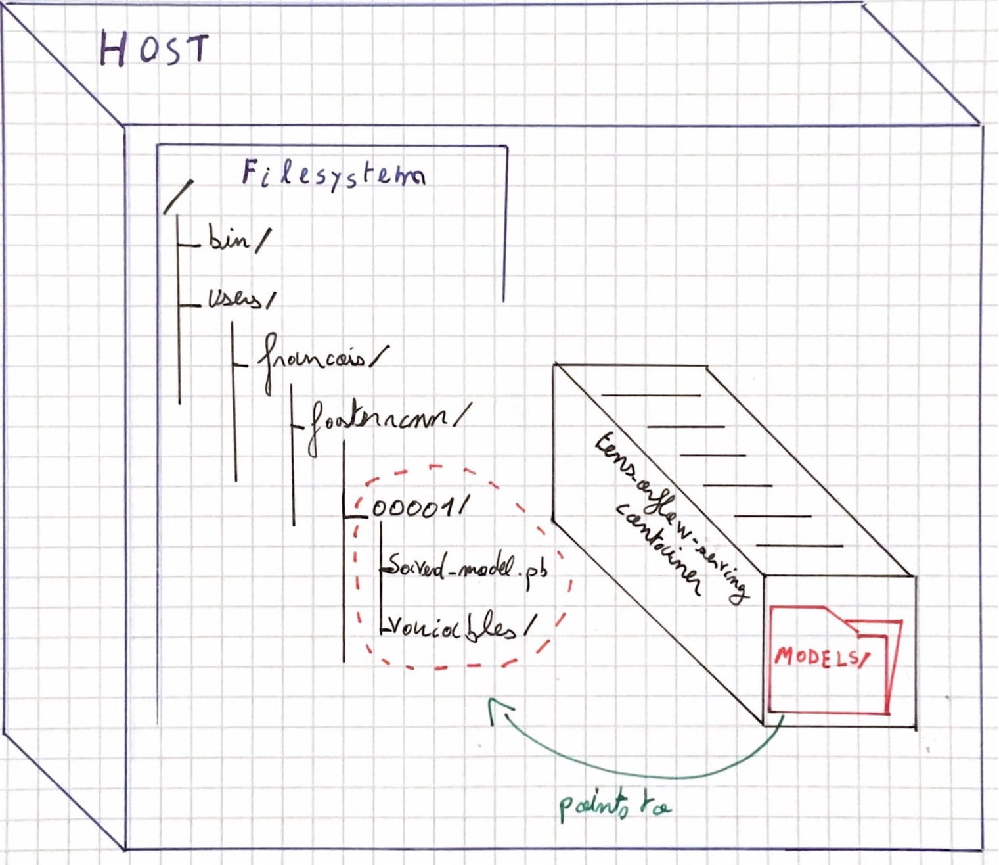

# Create a local tensorflow server and call it for inference

Finalize your setup by running your first tensorflow-server on local.
You will be able to make object detection over `jpeg` images in a few minutes!

1. Run the tensorflow server, pay attention to forward the port `8501` and bind the correct path.
Fine tune the `-v` arg if you use a different model.
```bash
# From tensorflow-serving_sidecar/
MODEL_DIR_NAME=faster_rcnn_resnet101_coco_2018_01_28
MODEL_NAME=faster_rcnn_resnet
docker run -t --rm -p 8501:8501 \
   -v "$(pwd)/data/$MODEL_DIR_NAME:/models/$MODEL_NAME" \
   -e MODEL_NAME=$MODEL_NAME \
   tensorflow/serving &
```
_What did we just do there?_ 

We simply run a docker container from the original `tensorflow-server` image. We bind the directory on the local host filesystem containing our `faster_rcnn_resnet101_coco_2018_01_28`
 model with the `models/` directory inside the container. The container can read and write data from this shared directory. 

This simple drawing sums it up:
 
  

2. Now that we have a local server running we call call it on `localhost:8501`.
Call the server to perform an inference. Fine tune the `--server_url` argument if you use a different model.
The `client.py` script is a very simple script to pre-process the input image, perform the API call, and process the server's output. 
It returns detections score and build the annotated image. 

```bash
# Don't forget to activate your python3.6.5 venv

# From tensorflow-serving_sidecar/
MODEL_NAME=faster_rcnn_resnet

python client.py --server_url "http://localhost:8501/v1/models/$MODEL_NAME:predict" \
--image_path "$(pwd)/object_detection/test_images/image1.jpg" \
--output_json "$(pwd)/object_detection/test_images/out_image1.json" \
--save_output_image "True" \
--label_map "$(pwd)/data/labels.pbtxt"
```

If everything works fine you should have an image generated under `object_detection/test_images/out_image1.jpeg`.
With the provided model and example it should look like:
 

Congrats, you just built your first tensorflow server!
Go ahead and try with your own `.jpeg` images! You can fine tune the client code if you want to work with other kind of images.

---- 
## What's next?

Now that you master how to serve a model on local, let's go bigger and serve this model on the cloud 
 so you can actually use it in your other applications or on your website! 

Learn how to deploy a tensorflow model on Google Compute Platform with [this tutorial](tf_server_k8s.md).
