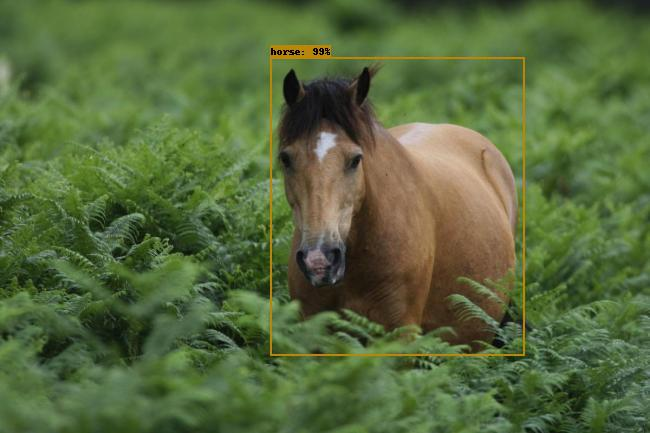

# How to serve your machine learning model with `tensorflow-serving`

This repo offers detailed _How-to_ about serving your tensorflow models with `tensorflow-serving`.
It can be followed as a step-by-step tutorial to serve your ``tensorflow`` model or other models with some adjustments. 

### Scope of the project
I do not cover the parts of training or exporting models here.
I focus solely on serving a model for inference.

### What's in the box?

Two tutorials: 

1. A basic tutorial to get you quickly serve an object detection model with `tensorflow-serving`. 
Expect to get such an awesome object-detection up and running in less than 10 mins.
 

2. An advanced tutorial to deploy your tensorflow server docker image on Google Cloud Platform.
Unleash the power of GCP to build a scalable machine learning server running in a ``kubernetes`` cluster.

*The proposed object detection model is here to get you started quickly, feel free to use yours for more fun!*

The reader is expected to be familiar with tensorflow, knowing how to export a model for inference will be helpful (`tensorflow-server` works with `savedModel`).
Knowing docker or kubernetes are not pre-requisites since the commands used are simple and explained when needed.

Those tutorials are highly inspired by [tensorflow-serving official documentation](https://www.tensorflow.org/serving/docker)
with some tips and more detail on the installation process. 

## 0. Install the project

The installation process is thoroughly described in the [docs/setup.md](docs/setup.md). It covers everything you need to do
prior being able to serve a model with tensorflow-serving.

## 1. Serve your first model and perform inference with tensorflow-serving

_Play Time!_

To make sure the installation went smoothly, get your first inference result from the object detection model tensorflow serving.
Follow the first tutorial to serve an object detection model on your machine [docs/tf_server_local.md](docs/tf_server_local.md).

## 2. Deploy your model on the cloud for high availability

Now that we made sure our inference server works great on local, let's deploy it on the cloud at production scale.
Let's dive in the [docs/tf_server_k8s.md](docs/tf_server_k8s.md).

----------

### Resources 

Additional information you may find useful

Google proposes a managed solution - _Google Cloud ML Engine_ - to serve your `saved_models.pb` models. 
I do not focus on it since [google documentation](https://cloud.google.com/ml-engine/docs/tensorflow/deploying-models) is
a more comprehensive source of information.

**Pros**
- Deploy new models easily

**Cons**
- Less flexibility
- As of today, you are limited in size for your `savedModel.pb` file to `250 MB`. (That may change) 

----------

### Credits

The `object_detection` directory comes from the
[tensorflow-model](https://github.com/tensorflow/models) repository. 
It offers useful `utils` functions to tag the image returned from the model.

Feel free to investigate the models on the `tensorflow-model` repo since they are well documented and often comes with useful tutorials.

